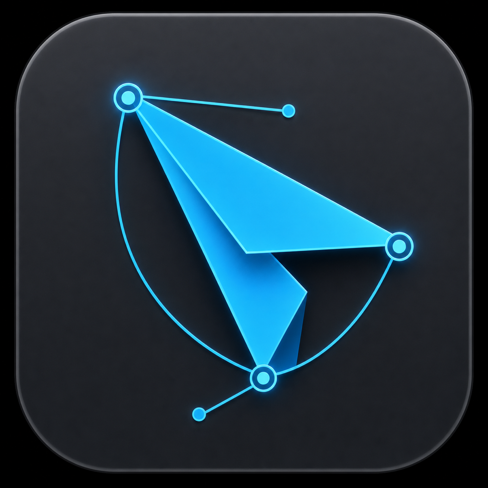
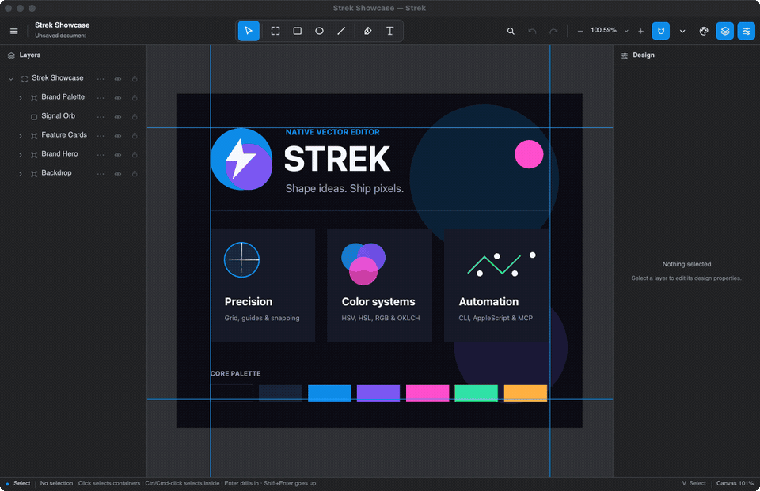

<p align="center">
  
</p>

<h1 align="center">Strek</h1>

<p align="center">
  A native, automation-ready vector editor for logos and icons, built in Rust with GPUI.
</p>

<p align="center">
  <a href="https://github.com/HelgeSverre/strek/actions/workflows/ci.yml"></a>
  
  
  
  <a href="LICENSE"></a>
</p>

Strek is a GPUI desktop application backed by reusable editor, rendering, and
export crates. Its native interface is designed around focused logo and icon
workflows rather than general-purpose illustration.

The project is under active development. Core editing workflows are usable, but
the file format and UI should not yet be treated as stable.

<p align="center">
  
</p>

<p align="center">
  <em>Recorded entirely through Strek's cursor-free automation API.</em>
</p>

## What works

- Selection, marquee selection, grouping, ordering, alignment, and distribution
- Layer tree editing: rename, visibility and lock state, reordering, and
  reparenting
- Frames, rectangles, ellipses, lines, Bézier paths, and editable text
- Direct vector editing for anchors and handles, including join, split, reverse,
  and open/close operations
- Move, resize, rotate, snapping, pan, zoom, undo, and redo
- Native Layers and Design panels, including layer context actions, transform
  decomposition readouts, and auto-layout mode, direction, spacing, and padding
  controls
- Text editing with selection, IME composition, family, weight, italic, size,
  and alignment controls
- Live horizontal scrubbing and fine/coarse steppers for position, opacity,
  stroke width, text size, and auto-layout spacing/padding, plus double-click
  typed entry; each completed scrub is committed as one undo step and `Escape`
  cancels it
- Frame background toggling and per-tool fill/stroke defaults for new shapes and
  paths
- Reusable fill/stroke color picker with a hue/saturation wheel, HEX and alpha
  editing, presets, HSV, HSL, RGB, gamut-mapped OKLCH controls, searchable Saved
  Colors, and quick save
- Zoom-adaptive rulers and grid, persistent draggable guides, guide locking and
  exact coordinate entry, plus independent object/guide/grid snapping controls
- A document-local Color Library with named groups, inline editing, manual and
  perceptual sorting, drag reordering, and remembered modeless panel placement
- Command palette, menus, and configurable shortcuts
- Native JSON document open/save with validated scene graphs and recent files
- SVG import into editable native layers, preserving root viewport dimensions
  and viewBox mapping plus outlined text, gradients, clips, compound fills, and
  advanced strokes, with explicit errors for unsupported features
- SVG, outlined-text SVG, PNG, JPEG, and WebP export
- Copy visible artwork to the clipboard in the image formats supported by the
  current platform
- Cursor-free CLI, AppleScript, and MCP automation with document-tree
  inspection, session-stable layer IDs, semantic edits, explicit file paths,
  direct export artifacts, and semantic precision/guide/Color Library tools

## Run the GPUI app

Strek supports macOS, Linux, and Windows. Install a stable Rust toolchain first.
On macOS, install the Xcode Command Line Tools. On Windows, use the MSVC Rust
toolchain and install Visual Studio Build Tools with Desktop development with
C++ and a current Windows SDK. On Ubuntu or Debian, install GPUI's native build
and runtime dependencies:

```sh
sudo apt-get update
sudo apt-get install --yes \
  build-essential \
  fonts-dejavu-core \
  libfontconfig-dev \
  libvulkan1 \
  libwayland-dev \
  libxkbcommon-x11-dev
```

Then run:

```sh
cargo run -p strek
```

With [just](https://github.com/casey/just) installed, the equivalent command is:

```sh
just run
```

## Install

Strek is under active development. Tagged releases include Linux archives for
x86-64 and ARM64, a Windows x86-64 MSI installer and portable ZIP, and a
universal macOS installer for Apple Silicon and Intel. The macOS installer is
Developer ID-signed and notarized by Apple. On macOS and Linux, Homebrew
automatically selects the archive for the current platform:

```sh
brew install helgesverre/tap/strek
```

On Windows, download `strek-x86_64-pc-windows-msvc.msi` from the GitHub Release.
The installer lets you choose the installation directory and whether to add
Strek to the system `PATH`. The matching ZIP remains available as a portable
installation.

Linux also requires a Vulkan-capable GPU and driver plus the desktop libraries
listed in [Run the GPUI app](#run-the-gpui-app).

You can also run from source or create a local package as described below.

## Automation

Strek can be inspected and controlled without moving the system cursor through
its CLI, bundled AppleScript helper, or MCP server:

```sh
strek automate state
strek automate action tool.rectangle
strek automate pointer down 120 100
strek automate pointer move 360 260
strek automate pointer up 360 260
```

Run `scripts/record-readme-demo.sh` on macOS to reproduce the showcase GIF
without bringing Strek to the foreground. The script requires `ffmpeg`, `jq`,
and ImageMagick's `magick` command in addition to the normal build prerequisites.

The packaged app includes an AppleScript helper:

```sh
osascript "/Applications/Strek.app/Contents/Resources/AUTOMATION.applescript" state
```

### Connect the MCP server

Strek includes a local stdio MCP server. The desktop application must already
be running; the MCP process forwards tool calls to that application. Each
example resolves the absolute path to the installed binary and is independently
copy-pastable. The shell blocks are for macOS/Linux; use the PowerShell blocks
on Windows. When running from source, use `$PWD/target/debug/strek` on
macOS/Linux or `Resolve-Path .\target\debug\strek.exe` on Windows.

Claude Code (user scope):

```sh
STREK_BIN="$(command -v strek)"
claude mcp add --scope user strek -- "$STREK_BIN" mcp
```

```powershell
$STREK_BIN = (Get-Command strek).Source
claude mcp add --scope user strek -- $STREK_BIN mcp
```

OpenCode:

```sh
STREK_BIN="$(command -v strek)"
opencode mcp add strek -- "$STREK_BIN" mcp
```

```powershell
$STREK_BIN = (Get-Command strek).Source
opencode mcp add strek -- $STREK_BIN mcp
```

Codex:

```sh
STREK_BIN="$(command -v strek)"
codex mcp add strek -- "$STREK_BIN" mcp
```

```powershell
$STREK_BIN = (Get-Command strek).Source
codex mcp add strek -- $STREK_BIN mcp
```

GitHub Copilot CLI:

```sh
STREK_BIN="$(command -v strek)"
copilot mcp add strek -- "$STREK_BIN" mcp
```

```powershell
$STREK_BIN = (Get-Command strek).Source
copilot mcp add strek -- $STREK_BIN mcp
```

Amp:

```sh
STREK_BIN="$(command -v strek)"
amp mcp add strek -- "$STREK_BIN" mcp
```

```powershell
$STREK_BIN = (Get-Command strek).Source
amp mcp add strek -- $STREK_BIN mcp
```

Restart or reconnect the client after adding the server if it does not discover
Strek immediately. The MCP server exposes document-tree inspection and
session-stable layer IDs, semantic selection/property/color edits, explicit file operations,
direct SVG/PNG/JPEG/WebP artifacts, editor actions, canvas pointer input with
modifiers, text insertion, UI visibility controls, and screenshots.

See [docs/automation.md](docs/automation.md) for the complete CLI, AppleScript, and MCP
surface, client configuration, state schema, coordinates, permissions, and
troubleshooting.

## Keyboard and pointer controls

`Primary` means `⌘` on macOS and `Ctrl` on other platforms.

| Action | Shortcut |
| --- | --- |
| Command palette | `Primary`+`Shift`+`P` |
| Select, Frame, Rectangle | `V`, `F`, `R` |
| Ellipse, Line, Pen, Text | `O`, `L`, `P`, `T` |
| Undo / redo | `Primary`+`Z` / `Primary`+`Shift`+`Z` |
| Copy / cut / paste | `Primary`+`C` / `X` / `V` |
| Duplicate | `Primary`+`D` |
| Group / ungroup | `Primary`+`G` / `Primary`+`Shift`+`G` |
| Delete | `Backspace` or `Delete` |
| Finish Pen, text, or vector editing | `Primary`+`Enter` |
| Join selected path endpoints | `Primary`+`J` |
| Zoom in / out | `Primary`+`+` / `Primary`+`-` |
| 100% / reset view | `Primary`+`1` / `Primary`+`0` |
| Fit artwork / fit selection | `Primary`+`Shift`+`1` / `Primary`+`2` |
| Nudge / large nudge | Arrow keys / `Shift`+arrow keys |
| Enter selection / select parent | `Enter` / `Shift`+`Enter` |
| Cancel or leave the current mode | `Escape` |
| Temporary hand tool | Hold `Space` and drag |
| Pan | Middle-button drag or trackpad/scroll wheel |

The in-app command palette and menus expose the complete command set. Choose
**Strek → Keyboard Shortcuts…** to create and open the user
`keybindings.json`; changes take effect after restarting the app. A string
replaces a binding, an array assigns alternatives, and `null` disables it.

## Documents and export

Documents are stored as versioned JSON. Saving an extensionless filename adds
the native `.strek.json` extension. The loader validates the scene graph before
opening it, and writes use a same-directory temporary file before replacement.
The native format is not stable yet; see
[docs/file-format.md](docs/file-format.md) for the current representation and
compatibility limits.

Use the File menu to export visible artwork as standard SVG, outlined-text SVG,
transparent PNG, JPEG, or lossless WebP. Export bounds are derived from the
artwork rather than the current viewport. JPEG output composites transparent
pixels over white; PNG and WebP preserve transparency.

The same visible-artwork snapshot can be copied from the File menu or command
palette. macOS supports SVG, PNG, and WebP clipboard images; Windows supports
SVG and PNG. Image-copy commands are unavailable on Linux and omitted from its
File menus because the pinned GPUI backend does not publish image-only clipboard
payloads there. Receiving applications may still vary in which advertised image
formats they accept.

Standard SVG keeps text as editable text and relies on compatible fonts being
available when the file is opened. Outlined-text SVG converts glyphs to paths
for portable appearance. Strek does not automatically embed fonts in SVG files.

### SVG import

Opening an `.svg` file imports its supported contents as editable native layers.
The supported subset includes groups and shape primitives; affine transforms;
solid and linear/radial gradient paints; fill and stroke opacity; object/group
opacity; clipping; fill rules and paint order; stroke caps, joins, miter limits,
and dash patterns; and visibility. Root viewport dimensions and viewBox mapping
are represented by a transparent frame and content transform. CSS without the
unsupported features below, links, switches, reusable symbols, nested SVG, and
markers are accepted after `usvg` normalization. CSS type, class, and ID compound
selectors may contain at most one descendant combinator; selector matching is
charged against candidate attribute bytes and pre-normalization work limits.
Other combinators, attribute selectors, and pseudo-classes are rejected before
matching. CSS becomes visual native nodes; its original structure, link behavior,
and metadata are not round-tripped.
Text is converted using installed or fallback system fonts and imported as
path-editable outlines, not semantic text. Quadratic curves and shape primitives
are converted to the editor's cubic path representation.

Gradient, advanced-stroke, and clip values survive native save/load and render
and export correctly, but they do not yet have dedicated native editing controls.
Advanced canvas artwork is displayed through a bounded world-space software
raster cache; simple solid artwork retains native GPUI path rendering. Every new
artwork revision and active geometry scrub gets an immediate preview at most
4,096 pixels per axis and 1,000,000 pixels total (about 4 MB of RGBA pixels).
Settled artwork refines after a 50 ms
trailing-edge delay at most 16,384 pixels per axis and 16,000,000 pixels total,
about 64 MB of RGBA pixels, using power-of-two density tiers derived from zoom
and display scale. Artwork beyond either cap is proportionally downsampled. CPU
rasterization runs off the UI thread. The cache keeps one active image and, only
while replacing it, one rollback image until the replacement paints successfully;
the transient two-image ceiling is about 128 MB for settled images, and document
replacement clears both. Pan and zoom reuse the active world-space image while
selection and tool overlays remain native. Dashed strokes currently use continuous
centerline hit testing, including dash gaps.

Strek rejects the whole import with a descriptive error when the SVG uses a
feature that cannot be represented faithfully. This includes images, patterns,
masks, filters, blend modes or isolation, non-scaling strokes, context-dependent
paints, CSS at-rules, SVG 2 focal radii, arcs joins, and non-sRGB gradient color
interpolation. External resource references and duplicate, ambiguous, missing,
wrong-typed, or cyclic local resource references are rejected before
normalization. Excessive nesting, normalization expansion, node counts, path
segments, gradient stops, dash values, text, and geometry attribute sizes are
also rejected before conversion.

An imported SVG is treated as an unsaved native document. Saving opens a Save As
dialog and writes `.strek.json`; Strek never overwrites the source SVG.

Exports use the bounds of all visible artwork rather than a selected frame or a
custom export preset. In the Design panel, width/height and transform
decomposition values are currently readouts; numeric adjustment is available for
the properties listed above through stepping and scrubbing, but direct text entry
is not yet available.

## Development

Run the repository checks locally:

```sh
cargo fmt --all -- --check
cargo clippy --workspace --all-targets --locked -- -D warnings
cargo nextest run --workspace --all-targets --locked
cargo audit
```

Useful `just` recipes:

```sh
just test    # workspace tests
just lint    # Clippy with warnings denied
just format  # format the workspace
```

Tagged versions matching `vX.Y.Z` run the cargo-dist release workflow and attach
Apple Silicon, Intel macOS, x86-64 Linux, ARM64 Linux, and x86-64 Windows
archives plus the Windows MSI to a GitHub Release, then publish the matching
macOS/Linux formula to `helgesverre/homebrew-tap`.

## Package for macOS

The GPUI package metadata and packaging script produce a universal macOS
application and installer. Install the pinned packager once, then run a local
unsigned structure test:

```sh
cargo install cargo-packager --version 0.11.8 --locked
.github/scripts/package-macos-pkg.sh --unsigned
```

Unsigned local packages must not be distributed. Production packages are built
in GitHub Actions, signed with separate Developer ID Application and Installer
certificates, notarized, stapled, verified, and attached to tagged releases.
See [docs/macos-release.md](docs/macos-release.md) for the one-time Apple and
GitHub credential setup, manual test workflow, and release procedure.

## Package for Windows

Cargo-dist and WiX produce the Windows MSI on a native Windows runner. The
manual installer workflow tests a custom-path installation and uninstall without
creating a release. See [docs/windows-release.md](docs/windows-release.md) for
the workflow, stable GUIDs, release artifacts, and optional Authenticode signing
setup.
